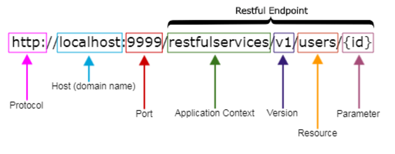

# API Rest

Une API Rest (REST = REpresentational State Transfer), c'est une  API qui est construite en respectant les principes de conception REST.

## Principes de conception

- Une API RESTful (donc une api au format REST) renvoi les données au demandeurs via un format défini, le plus courant étant le JSON
- Les requêtes HTTP envoyées et émises d'une API Rest contiennent dans leurs en-têtes des informations spécifiques. Cela peut être :
    - Informations d'authentification
    - Données relatives au cookies
    - URI (Uniform Resource Identifier) : Données tirés de l'URL
- Lien entre un client et un serveur, les deux ayant leur rôles bien définis
- Une interface entre ce client et ce serveur permettant de :
    - accéder à la documentation de ces données, pouvoir les manipuler simplement
    - auto-découvrabilité : En ayant obtenu une réponse abstraite, la réponse permet de savoir quelle requête effectuer pour explciter cette données.

  [Lien doc](https://www.nicolashachet.com/blog/developpement-php/larchitecture-rest-expliquee-en-5-regles/)

## Structure d'URI à respecter

